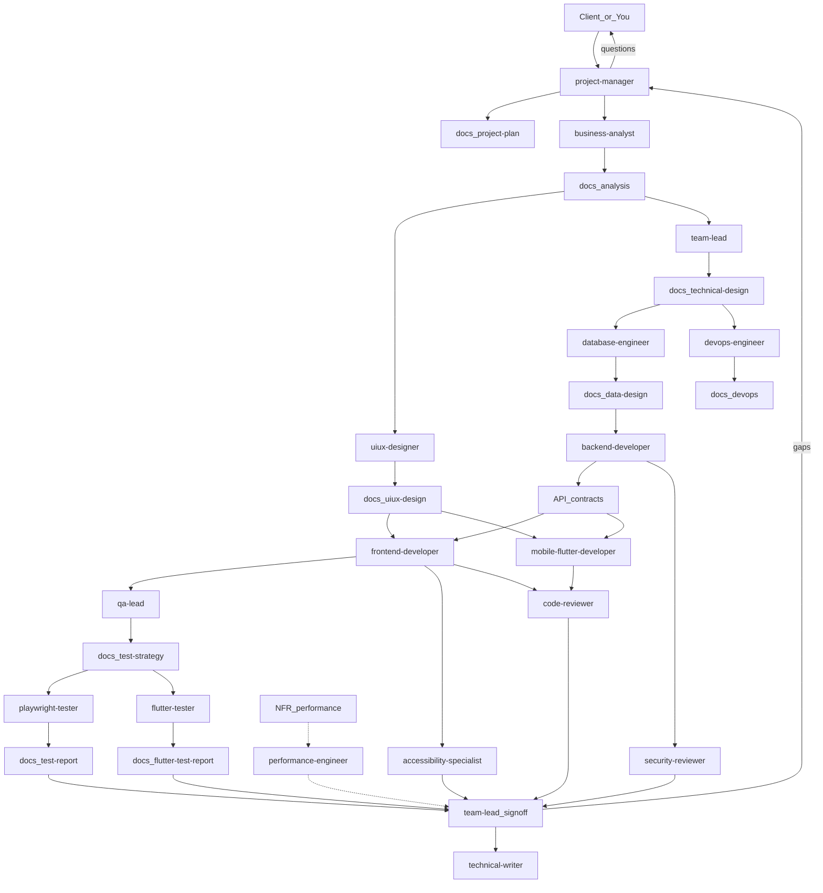

# HOWTO: Multi-Agent Workflow

How to use the Firebrand Agents pack together in Cursor: **18 subagents**, skills, an always-on rule, and slash commands.

## Agents vs Skills vs Rules vs Commands

| Kind | What it is | When it runs | Example |
|------|------------|--------------|---------|
| **Agent** (subagent) | Isolated specialist with a clean context. You (or the parent) **invoke** it by name. | On demand: `Use the project-manager subagent to …` | `team-lead`, `backend-developer` |
| **Skill** | Markdown playbook the model can **auto-discover** (`SKILL.md` description). Teaches *how* to do a task. | When the task matches the description (or you name the skill) | `docs-contract`, `dotnet-backend` |
| **Rule** | Persistent instruction in `.cursor/rules/` | `alwaysApply: true` → every chat in that scope | `firebrand-agents-workflow.mdc` |
| **Command** | User slash prompt (`.cursor/commands/*.md`) | When you run `/start-project`, `/review-changes`, `/run-e2e`, `/run-flutter-tests` | Greenfield, review, E2E |

**Practical split:** the **rule** keeps docs IDs and “only PM talks to the client” in every session. **Skills** add routing and stack defaults without a subagent. **Agents** do the owned artifacts (plan, analysis, code, tests). **Commands** are one-click prompts that chain those pieces.

Subagents do **not** share chat history. Paste paths and FR/WP/SCR IDs into every invoke.

## What these agents are

Each file in `agents/` is a Cursor **subagent**. They read/write shared docs in the **application** workspace (open the product repo, not only this pack folder).

## Prerequisites

1. Run [`install.ps1`](../install.ps1) (or copy agents/skills/commands/rules — see [README.md](../README.md)).
2. Open the **application repo** as the Cursor workspace when building a product.
3. Keep a shared `docs/` folder (see [docs contract](#docs-contract)).

## Docs contract

| Artifact | Path | Owner |
|----------|------|-------|
| Project plan | `docs/project-plan.md` | PM |
| Analysis | `docs/analysis.md` | BA |
| UI/UX design | `docs/uiux-design.md` | UID |
| Technical design | `docs/technical-design.md` | TL |
| Data design | `docs/data-design.md` | DBE |
| DevOps | `docs/devops.md` | DO |
| Test strategy | `docs/test-strategy.md` | QAL |
| Test report (web) | `docs/test-report.md` | playwright-tester |
| Test report (Flutter) | `docs/flutter-test-report.md` | flutter-tester |
| Security review | `docs/security-review.md` | SEC |

Optional: `docs/a11y-review.md` (A11Y), `docs/perf-notes.md` (PERF), `docs/review-notes.md` (CR).

Stable IDs: `FR-`, `NFR-`, `SCR-`, `WP-`, `T-`, `Q-`. Owners must **not** silently rewrite BA FRs.

Templates live in this pack under [`templates/`](../templates/).

## Escalation protocol

```text
Developer / UID / TL / Tester finds missing product info
        ↓
Report Blockers for PM (do not invent requirements)
Mark guesses as Assumption (pending PM)
        ↓
project-manager collects Client questions
        ↓
You answer as the client
        ↓
PM updates docs/project-plan.md (and asks BA/TL to refresh docs)
```

Only **PM** should drive client Q&A. Other agents escalate to PM.

## Recommended phase order



Playwright is **web-only**. `flutter-tester` covers native Flutter. PERF runs **when NFRs** (or reported slowness) require it — not on every project.

## Phases

| Phase | Invoke | Produces | Done when |
|-------|--------|----------|-----------|
| 1. Intake | `project-manager` | `docs/project-plan.md` | Goals/scope listed; client Qs asked |
| 2. Analysis | `business-analyst` | `docs/analysis.md` | FRs/NFRs written; open `Q-` listed |
| 3a. UX | `uiux-designer` | `docs/uiux-design.md` | Screens/flows ready for FED/MFD |
| 3b. Tech | `team-lead` | `docs/technical-design.md` | Work packages + API shape |
| 4. Data | `database-engineer` | `docs/data-design.md` + migrations | Physical model matches entities |
| 5. API + env | `backend-developer` + `devops-engineer` | .NET API + `docs/devops.md` | FED/MFD can integrate; stack runs |
| 6. Clients | `frontend-developer` / `mobile-flutter-developer` | Angular / Flutter | Matches design + analysis |
| 7. Test plan | `qa-lead` | `docs/test-strategy.md` | Must FRs mapped or deferred |
| 8. E2E (web) | `playwright-tester` | Playwright + `docs/test-report.md` | Critical web journeys recorded |
| 8b. Flutter tests | `flutter-tester` | Widget/integration + `docs/flutter-test-report.md` | Critical mobile journeys recorded or Blocked |
| 9. A11Y | `accessibility-specialist` | a11y findings / fixes | In-scope screens listed |
| 10. Review | `security-reviewer` + `code-reviewer` | `docs/security-review.md` + CR notes | Critical closed or assigned |
| 11. Sign-off | `team-lead` | Review notes | Critical issues fixed |
| 12. Docs | `technical-writer` | README / operator docs | Start/test steps accurate |
| *Perf* | `performance-engineer` | `docs/perf-notes.md` | When NFRs or slowness |

UID and TL can run **after** analysis, in parallel. DBE before large BED work when persistence is in scope. FED/MFD should wait for (or explicitly stub, with TL) BED contracts. Run QAL then `playwright-tester` after FED and `flutter-tester` after MFD. A11Y after FED. SEC+CR before final TL sign-off.

## How to invoke

In Agent chat (or `/start-project`):

```text
Use the project-manager subagent to start a project plan for <product>.
Client wants: <goals>. Platforms: Angular web, Flutter mobile, .NET API.
```

Then follow the PM’s **Next handoff** prompt. Always pass **full context** (paths + IDs).

```text
Use the business-analyst subagent to create docs/analysis.md from docs/project-plan.md.
Resolve nothing by guessing — list client questions for PM.
```

```text
Use the team-lead subagent to write docs/technical-design.md from docs/analysis.md
and define work packages for DBE, BED, DO, FED, MFD, QAL, and Playwright.
```

```text
Use the database-engineer subagent to produce docs/data-design.md and EF migrations for WP-DBE-01.
```

```text
Use the backend-developer subagent to implement WP-BED-01 from docs/technical-design.md.
Publish endpoint contracts for Angular and Flutter.
```

```text
Use the devops-engineer subagent to document local run and env vars in docs/devops.md for WP-DO-01.
```

```text
Use the frontend-developer subagent to implement SCR-001..SCR-00N from docs/uiux-design.md
using the API contracts from the backend.
```

```text
Use the mobile-flutter-developer subagent to implement the mobile journeys in docs/analysis.md
against the same API contracts.
```

```text
Use the qa-lead subagent to write docs/test-strategy.md mapping Must FRs to unit/API/Playwright/Flutter tests.
```

```text
Use the playwright-tester subagent to add and run Playwright E2E for T-IDs in docs/test-strategy.md.
Write docs/test-report.md.
```

```text
Use the flutter-tester subagent to add and run Flutter widget and integration tests for mobile T-IDs
in docs/test-strategy.md. Write docs/flutter-test-report.md.
```

```text
Use the accessibility-specialist subagent to review SCR-… in the Angular app.
```

```text
Use the security-reviewer subagent to review auth and PII paths; write docs/security-review.md.
```

```text
Use the code-reviewer subagent to review the current diff against WP-… and docs/analysis.md.
```

```text
Use the team-lead subagent to sign off against docs/analysis.md, docs/technical-design.md,
docs/test-report.md, docs/flutter-test-report.md, and docs/security-review.md.
```

```text
Use the technical-writer subagent to update README how-to-run from docs/devops.md and OpenAPI.
```

```text
Use the performance-engineer subagent to check NFR-… (only if a numeric or stated target exists).
```

## Example: greenfield web + mobile

Prefer `/start-project` or skill `start-greenfield`. **Do not** implement the whole product in one pass.

**You → PM**

```text
Use the project-manager subagent to plan "Inventory Tracker".
Client: small warehouse. Need web admin (Angular) and mobile stock checks (Flutter).
Backend must be .NET. Users: warehouse manager + floor staff. Must support login.
```

**PM → you:** plan path + client questions (e.g. offline mode? barcode?).

**You → BA** (after answers)

```text
Use the business-analyst subagent to produce docs/analysis.md for Inventory Tracker
using the updated docs/project-plan.md.
```

**You → UID and TL** (can be two messages / parallel)

```text
Use the uiux-designer subagent to create docs/uiux-design.md from docs/analysis.md.
```

```text
Use the team-lead subagent to create docs/technical-design.md and work packages.
```

**You → DBE → BED + DO → FED & MFD → QAL → playwright-tester + flutter-tester → A11Y → SEC + CR → TL → TW** as in the phase table.

## Tips for reliable handoffs

- Keep artifacts in `docs/` so new chats and subagents share context.
- Paste paths and WP IDs into each invoke prompt; subagents start with a **clean** context.
- One work package per developer invoke when possible.
- If two platforms share an API, finish BED contracts before large FED/MFD UI wiring.
- For Playwright: ensure the web app (and API if needed) can start locally; pass base URL / test user notes.
- For Flutter tests: pass flavor/API URL; widget tests can run without a device; integration_test needs an emulator or is marked Blocked.
- Re-run `install.ps1` after you edit this pack (see README).

## Agent name cheat sheet

| Role | Abbrev | Invoke name |
|------|--------|-------------|
| Project Manager | PM | `project-manager` |
| Business Analyst | BA | `business-analyst` |
| Team Lead | TL | `team-lead` |
| UI/UX Designer | UID | `uiux-designer` |
| Database Engineer | DBE | `database-engineer` |
| Backend Developer | BED | `backend-developer` |
| DevOps Engineer | DO | `devops-engineer` |
| Frontend Developer | FED | `frontend-developer` |
| Mobile Flutter Developer | MFD | `mobile-flutter-developer` |
| QA Lead | QAL | `qa-lead` |
| Playwright Tester | — | `playwright-tester` |
| Flutter Tester | — | `flutter-tester` |
| Accessibility Specialist | A11Y | `accessibility-specialist` |
| Security Reviewer | SEC | `security-reviewer` |
| Code Reviewer | CR | `code-reviewer` |
| Performance Engineer | PERF | `performance-engineer` |
| Technical Writer | TW | `technical-writer` |
| Localization Engineer | L10N | `localization-engineer` |

## Skill / command cheat sheet

| Need | Use |
|------|-----|
| Start a new product | `/start-project` or skill `start-greenfield` |
| Who goes next / docs paths | skill `firebrand-agents-delivery` |
| Missing business rule | skill `escalate-requirements` → PM |
| Stable IDs / owners | skill `docs-contract` + rule `firebrand-agents-workflow` |
| .NET / Angular / Flutter defaults | `dotnet-backend`, `angular-frontend`, `flutter-mobile` |
| Web E2E | `/run-e2e` or `playwright-tester` + skill `playwright-e2e` |
| Flutter tests | `/run-flutter-tests` or `flutter-tester` + skill `flutter-test` |
| Diff before merge | `/review-changes` or `code-reviewer` + skill `code-review-checklist` |
